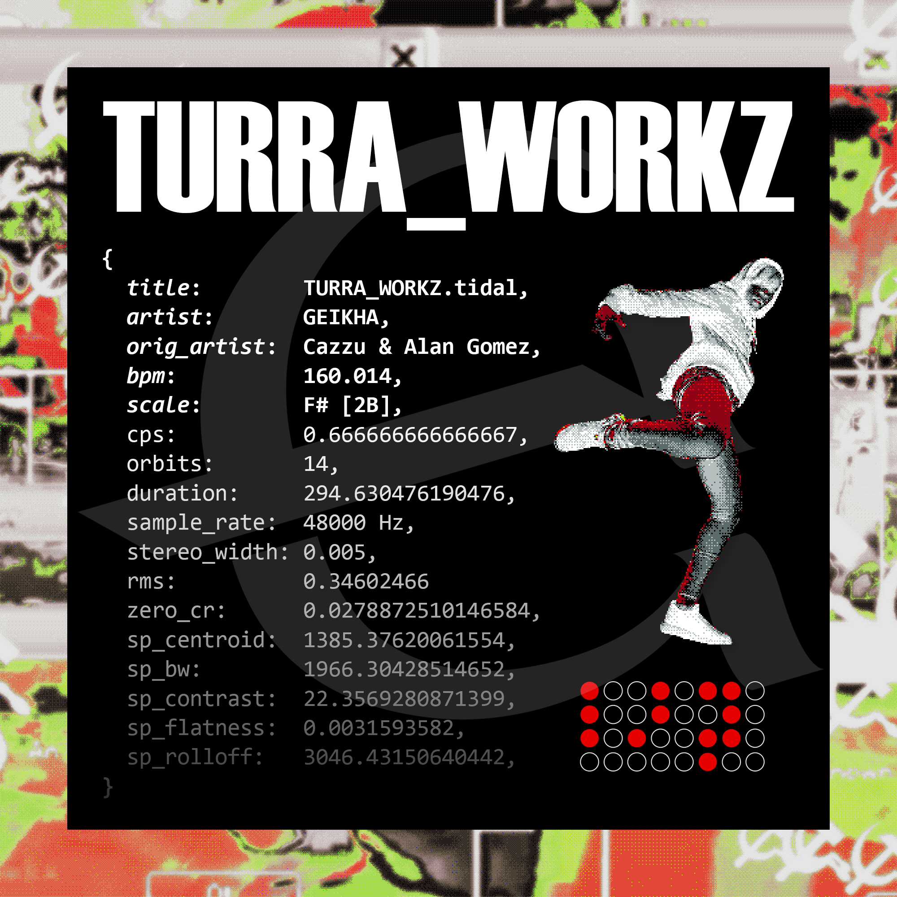

# TURRA_WORKZ
Code for my single [*TURRA_WORKZ*](https://geikha.bandcamp.com/album/turra-workz-coded-00), which is in itself an edit of the song *TURRA* by Cazzu & Alan Gomez. Made using [TidalCycles](https://github.com/tidalcycles/Tidal) and [SuperCollider](https://github.com/supercollider/supercollider).

[](https://geikha.bandcamp.com/album/turra-workz-coded-00)

## About this repo

### TidalCycles

`TURRA_WORKZ.tidal` contains the code of the song itself. While the `SETUP_241227.tidal` file all possible dependencies for this code, as it's my own personal setup file.

### SuperCollider

The `SC` folder contains a minimal boot for the project. The `SYNTHDEFS` folder contains many of the synths and effects I use as of time of upload.

### Samples

Samples are stored in an encrypted .zip file, you can use the password `geikha` to unzip them. This is just a minor measure given some samples count as copyrighted material.

## About the licenses

The code inside **`TURRA_WORKZ.tidal`** and its resulting audio is protected by the **CC BY-NC-SA license (Creative Commons Attribution-NonCommercial-ShareAlike)**. This means you are allowed to view, share, and adapt the code as long as you credit me somewhere. You cannot use it for commercial purposes, and you may only share your modifications of the code or its audio under this license or a compatible one. This also applies to the artwork image provided above.

The code inside **`SETUP_241227.tidal`** and everything inside the **`SC` folder** exist under the **GPL v3 license**. Meaning it may be used, shared, and modified at will. But distribution of modified versions must be shared under the same license.

---

```haskell
-- Original code, which turned into the full-length track
-- CC BY-NC-SA

do
  hush
  all $ id
  setbpm $ 160
  let trans = note (0)
  let note' n = note (scale "major" n+6) |+ trans -- 2B
  let kb = slow "1 <1 2> 1" $ (rotR (0/8)) $ mono $ foot "<4 5>"
  let _swing = swingBy (0/12) 8
  d1 $ stack [ silence
    ,kb # "jktnbd" # g "1_1e 0.8" # hpf 100
    -- ,"1([0 9 7],16,1)" # "8082ht" |+ note "<0!3 3>" # sp 2 # sh 0.4
    -- ,"1([0 9 6],16,1)" # "808ht:10" |+ nt 6.6 |+ note' "[0..-8]" # sp 2 # sh 0.6 # triode 2 # l 1
     -- ,"8082hh*[16|6]*4" |+ note 5 # g 0.8 # l 1 # rel 0.2
     -- ,press $ "1*2" # "8082cp" |+ note 2 # rel 0.2 # g 1.1 # sh 0.13 -- # "808cp2:4"
     -- ,foot 3 # "8082perc" |+ note 2 # rel 0.1 # hpf 100
     -- ,rktsd # "rktsd:3" # bpf 1100 # b 0.012 # rel 0.3
     -- ,un1 "660oh(5,16)" # g 0.8 # cut 3 # rel 0.4 # trem' 16 0.2
     -- ,chat' 16 1 "amenbreak1" |+ note "<5 3>/8" # lpfrel 0.2 # rel 0.4 # l 1 # side 0.6 # crush 12
    ] # room' 0.02 0.1
  let bass = "<1 -2 -5 [-5_3 -7]>"--"-5"
  d3 $ (|+ note 0.33) $ kb # note' bass # "660bdp" # cut 1 # sh 0.6 -- # lpf 15000
  -- d4 $ kb # note' bass # "supersine" # oc 3 # ar 0.04 0.6 # sh 0.12 # l 3 # cut 1 # g 0.6 # lpf 240 |- note 0.06
  d5 $ revOn 1 $ chat' 4 4 "turra2" # cut 1 # room' 0.1 0.7 # hpf 200 # sp 1 # rel 0.3 # sh 0.2 # side 0.6
  -- d6 $ tl'' 8 (-0.5) $ chat' 8 8 $ "turra4" # n 0 # ts 1.25 # tsw 1.5 # l 1 # hpf 200 # room 0.2 |- note 0 # sh 0.2 # rel 0.6 # g 0.96 # air 0.13
  -- d7 $ b' 8 "[~/2,4]" # "turra4" # n 0 # l 1 # hpf 400 # g 0.9 # pitch 2 # gater 0.8 # wider 0.4
  getnow 8
```
